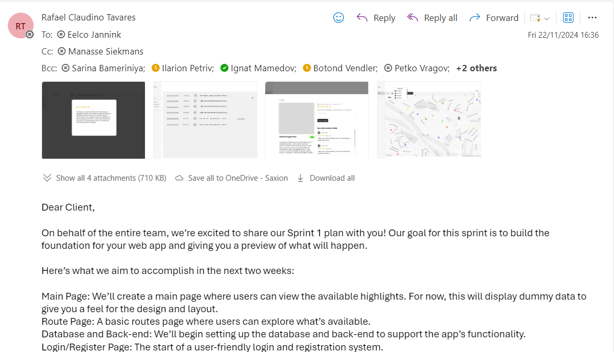
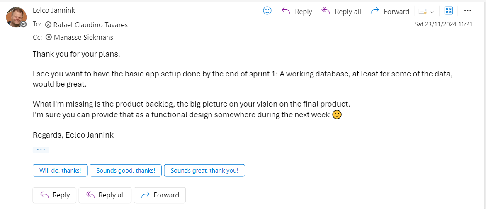
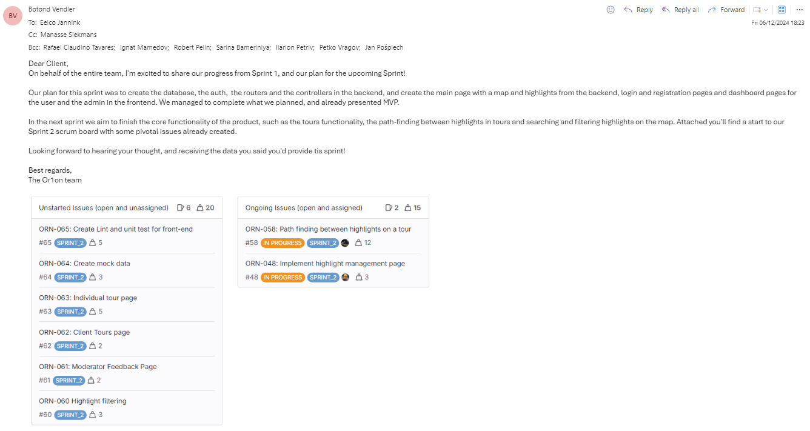
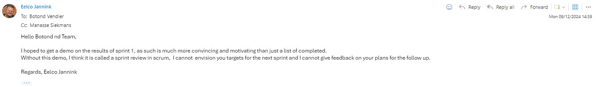
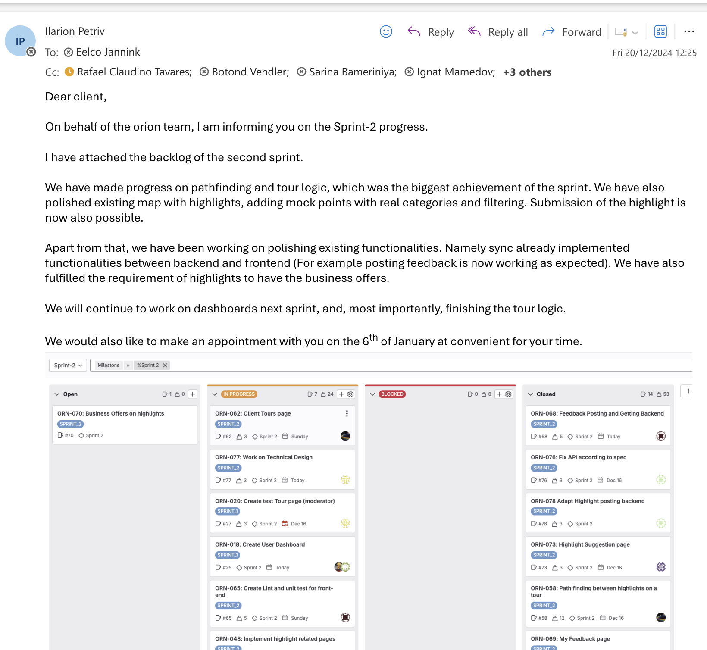
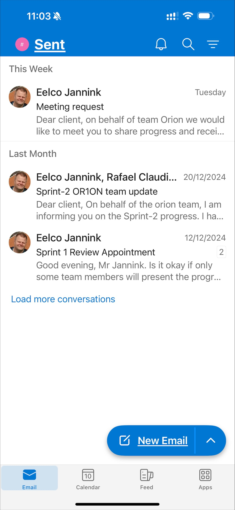

# Client Communication Log

## Sprint 0: Initial Client Meeting
**Date:** Initial class meeting

### Communication Overview
During Sprint 0, the first client meeting was held in class, where we had the opportunity to ask questions directly to the client. This meeting was critical for understanding the project's core requirements, user expectations, and business objectives. Additionally, we had the advantage of hearing the questions and answers from other teams, which helped broaden our understanding.

We prepared a comprehensive list of questions focusing on:
- Core features of the app
- User, system, and business requirements
- Additional functionalities and technical aspects

### Key Outcomes from the Meeting
Based on the notes and answers from the client, we concluded the following requirements:
- **Core Features**:
    - Provide shortest walking or biking routes with estimated travel times.
    - Categorized tours based on type, name, and description.
    - Logical order of highlights in tours, with user feedback and ratings.
    - Features like accessibility options, zoomable maps, and filterable highlights (optional).
- **User and Business Interactions**:
    - Promotions and offers integrated with highlights (optional).
    - Trusted users can provide feedback and suggest highlights for moderation.
    - Changable username and password.
    - Multilingual support (optional).
- **Moderator Controls**:
    - Review and approval of comments, ratings, and user accounts.
    - Ability to edit, add, remove highlights and tours.
- **Technical Details**:
    - Use of Google Maps API for navigation and GPS tracking.
    - Inappropriate behavior detection.

After the meeting, we merged the notes into **user requirements**, **business requirements**, and **system requirements**. These requirements served as the foundation for our project backlog and sprint planning.

### Communication Plan
The client provided their email address, and we made a plan to send retrospectives for every sprint. This allowed us to keep the client informed of progress and ensure alignment with the project goals.

### Proof Of Communication:

### Client Response:

-------------------------------------------------------------------------------

## Sprint 1: Progress Retrospective and Second Client Meeting

At the end of Sprint 1, we sent a retrospective email to the client outlining our achievements and requesting a follow-up meeting to discuss progress and showcase our work. The meeting was scheduled for **December 13th** on Microsoft Teams.

### Key Points Discussed in the Meeting
1. **Progress Overview**:
    - We demonstrated the initial implementation of the app based on core requirements such as map of the world with an algorithm for finding the shortest path, the frontend features for user and moderator dashboard, etc.
    - Presented goals for Sprint 2, including responsive design and minimum viable functionality.

2. **Feedback from the Client**:
    - Add a more visible icon for the user's current location to differentiate it from highlights.
    - Include arrows on navigation lines for better user guidance.
    - Implement functionality to communicate with the user when they deviate from the planned route.
    - Display blocked routes on the map.
    - Make the traveled path visible in green.
    - Improve application responsiveness for mobile devices.

3. **Next Steps**:
    - Plan Sprint 2 by the end of the following week.
    - Schedule the next client meeting for **January 9th** or **January 6th**.

### Proof Of Communication:

### Client Response:

----------------------------------------------------------------------------------

## Sprint 2: Communication Challenges

After the December 13th meeting, we attempted to schedule the next client meeting to align with Sprint 2 goals. Despite sending multiple emails (starting on **December 20th** and continuing after the Christmas holidays), the client did not respond. This lack of communication created significant challenges for our team, as we were unable to receive timely feedback.

After consulting with our course teacher, we finally managed to arrange a meeting on Microsoft Teams just **three days before the final deadline**. The client explained that they had "lost the emails" and suggested we should have emailed earlier, which was frustrating given our multiple prior attempts.

This demonstrates failed communication as multiple emails were sent without any response:

---

## Sprint 3: Final Client Meeting

The final client meeting was held on **January 16th**, just before the project deadline. This meeting covered progress from both Sprint 2 and Sprint 3.

### Key Points Discussed in the Meeting
1. **Progress Overview**:
    - All core functionalities were implemented, including:
        - Real highlights displayed on the map.
        - User location updated every 30 seconds.
        - Highlights integrated into tours.
        - Feedback functionality (pending merge).
        - Responsive design for mobile devices.
        - Users could perform key actions:
          - Provide, edit, and view their own feedback.
          - Change usernames and passwords.
          - Access all highlights and tours. 
        - Moderators had control over feedback approval, user management, and editing highlights/tours.

2. **Feedback from the Client**:
   - Security: Ensure the app uses JWT tokens and HTTPS.
   - Accessibility: Improve color contrast for users with disabilities (e.g., avoid excessive use of gray).
   - Usability:
      - Use predefined color palettes for better readability.
      - Highlight traveled paths in green.
      - Ensure smooth user communication during navigation.
   - Passwords: Avoid storing passwords in the repository.
   - Translation: While a good addition, it was noted that translation support was not a priority for this sprint due to time constraints.
   - Testing: Confirm that the app functions properly on mobile devices and in real-world navigation scenarios.
   - Documentation: Include a note about API request limits (e.g., 15,000 requests/day for Google Maps).
   
3. **General Feedback**:
   - The client appreciated the progress and overall functionality of the app.
   - They encouraged minor improvements (e.g., better color use) while acknowledging the current state was functional and aligned with expectations as well as the time could not cover this perfectly.

**Overall Assessment**: 
    Briefly, Despite communication challenges, our team successfully delivered a functional app that met the core requirements and aligned with the client's vision. The following strategies helped us maintain progress:
- Proactive preparation for client meetings, including detailed questions and organized notes.
- Regular updates through retrospectives, ensuring transparency about our progress.
- Collaboration within the team to address client feedback quickly.
While we faced challenges in maintaining consistent communication, the final product reflects our dedication to meeting the client's needs and delivering a high-quality solution.
