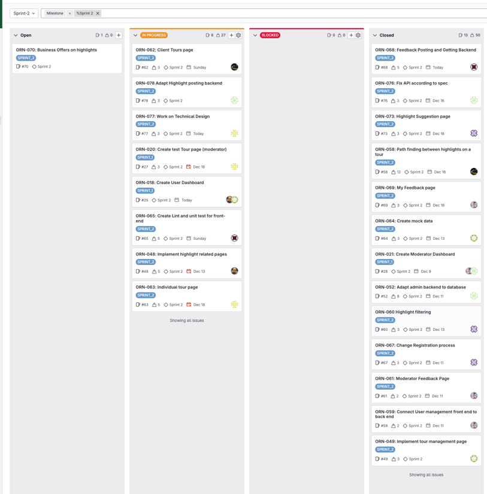

# Scrum Documentation

## Sprint 0 - Rafael Tavares

Create backlog, sprint 1 planning and work on documentation.

## Backlog

### 1st Meeting (13/11/2024)

Meeting Notes:

- Kick-off meeting. Discussed the project setup and the client letter.

Attendees: Rafael, Ilarion, Ignat, Jan, Petko, Sarina, Botond, Robert;

Absentees: None;

---

### 2st Meeting - (15/11/2024)

Meeting Notes:

- Created issues for the initial Sprint.
- Team members picked up issues to work on.

Attendees: Rafael, Ilarion, Ignat, Jan, Petko, Sarina, Botond, Robert;

Absentees: None;

---

### 3st Meeting - (20/11/2024)

Meeting Notes:

- Rafael and Ilarion: Done with the gitlab scrum boards setup.
- Ilarion: Done with DoD
- Petko: Done with the CoC
- Ignat: Done with the git development guide
- Jan, Sarina, Robert: Done with the list of questions concerning the assignment
- Botond: Cannot complete his task, until meeting with the client.

Attendees:  Rafael, Ilarion, Ignat, Jan, Pekto, Sarina, Botond, Robert;

Absentees: None;

---

#### 4st Meeting - (22/11/2024)

Meeting Notes:

- Rafael and Ilarion: Done with wireframes
- Robert: Done with business goals and requirements
- Botond, Petko: Done with system requirements
- Sarina, Jan: Done with user requirements
- Ignat: Done with system context and document formatting

Attendees: Rafael, Ilarion, Ignat, Jan, Petko, Sarina, Botond, Robert;

Absentees: None;

---

## Sprint End Backlog:

## Sprint-0 Retrospective

- What went well:
    - The team was able to complete majority (12/13) the tasks assigned to them.
    - The team was able to work together and communicate effectively.
    - The team was able to complete the sprint on time.
    - The team was able to get started on the documentation.
- What could have gone better:
    - The team could have created more issues for the sprint and thus put more work into the sprint.
- What will we commit to doing in the next sprint:
    - The team will try to burn 80 hours in the next sprint as per the assignment requirements.
    - The team will try to assign each member at least 2 issues in the next sprint.

## Sprint 1 - Botond Vendler

Create a functional backend and the base for the frontend already with some functionality.

### 1st Meeting (27/11/2024)

Meeting notes:

- Team members picked up issues to work on.
  Attendees: Rafael, Ilarion, Ignat, Jan, Petko, Sarina, Botond, Robert;
  Absentees: None;

---

### 2nd Meeting (29/11/2024)

Meeting notes:

- Ignat, Ilarion, Petko and Rafael finished their tasks.
- Others had either too big of a task to finish, or had to do some little fixes
  Attendees: Rafael, Ilarion, Ignat, Jan, Petko, Sarina, Botond, Robert;
  Absentees: None;

---

### 3rd Meeting (02/12/2024)

Meeting notes:

- Jan, Rafael, Ignat and Ilarion finished their tasks
- The others continued working on theirs
- Robert and Botond's tasks(backend) needed continuance for modifications because of the database
  Attendees: Rafael, Ilarion, Ignat, Jan, Petko, Sarina, Botond, Robert;
  Absentees: None;

---

### 4th Meeting (04/12/2024)

Meeting notes:

- The database was finalised, Robert and Botond can start their task to adapt their previous task
- Ignat and Ilarion finished their task, and got assigned new ones
- Others continued their tasks
  Attendees: Rafael, Ilarion, Ignat, Jan, Sarina, Botond, Robert, Petko;
  Absentees: None;

---

### 5th Meeting (06/12/2024)

Meeting notes:

- Botond made progress with his task, but hasn't finished it
- Petko's task was thought to be blocked by Botond, but it isn't he will work on it
- Jan made progress on his task, but hasn't finished yet
- The others finished their tasks
- The team started planning Sprint 2
  Attendees: Rafael, Ilarion, Ignat, Jan, Sarina, Botond, Robert, Petko;
  Absentees: None;

---

## Sprint End Backlog:

## Sprint-1 Retrospective

- What went well:
    - The team was able to complete majority the tasks assigned to them.
    - Adapting to technicalities we haven't used before (ORM, etc.)
- What could have gone better:
    - There could have been more communication between corresponding tasks.
    - Breaking down large issues into smaller ones if possible

## Sprint 2 - Ilarion Petriv

### Sprint 2 Planning

### 1st Meeting (9/12/2024)

Meeting Notes:

- Sarena: Couldn't finish Sprint-1 task, however, made some progress. Needs more time to finish it. Weight has been
  increased and the due date has been extended as per discussion.
- Petko: ORN-059 wasn't able to implement the feature, needs more time. Received a new task ORN-061 as per the
  discussion.
- Ilarion: Assigned to ORN-067 issue
- Jan: Assigned to ORN-063 issue. Since task is quite big, decided to set the date to the meeting after the next one.
- Botond: Didn't finish his Sprint-1 task (ORN-052), that's why no new task was assigned to him. The due date has been
  extended until next meeting and Robert is going to help him with the task.
- Robert: Assigned to ORN-052 issue to help. Also assigned to ORN-064 issue
- Rafael: Progress on ORN-058 issue. Issue description has been updated.
- Ignat: Helping Botond with ORN-052 issue. Assigned to ORN-065 issue

Attendees: Rafael, Ilarion, Ignat, Jan, Petko, Sarina, Botond, Robert;
Absentees: None;

---

### 2nd Meeting (11/12/2024)

Meeting Notes:

- Sarina: ORN-048 made progress, has time until 13/12 to finish it. ORN-018 removed from "blocked", will finish by 13/12
  as well.
- Petko: Has done both issues (ORN-059 and ORN-061), but needs to do minor hotfixes
- Ilarion: Finished ORN-067, assigned to ORN-060
- Jan: Missing
- Botond: Finished with ORN-052
- Robert: Weren't able to start ORN-064, cause the task was blocked. Due date is extended to 13/12
- Rafael: Made progress on path finding algorithm. Made it work, will extend it later.
- Ignat: Started working on ORN-065, will finish by 13/12

Attendees: Rafael, Ilarion, Ignat, Petko, Sarina, Botond, Robert;
Absentees: Jan (Informed in advance);

---

### 3rd Meeting (13/12/2024)

Meeting Notes:

- Ilarion: Finished ORN-060, assigned to ORN-073
- Ignat: Will finish his task by the end of the day (ORN-065). Was helping multiple team members with their tasks.
- Rafael: Made nice progress on ORN-058, will finish on 16/12 by cleaning up the code and refactoring.
- Botond: Finished ORN-052, assigned to ORN-076
- Robert: Finishing ORN-064
- Sarina: Made the issues, will proceed with refactoring and cleaning up the code until 16/12. Due date is extended
- Jan: Made progress, but needs more time to finish. Due date is extended until 18/12
- Petko: ORN-069 made progress, but needs more time to finish.

Attendees: Rafael, Ilarion, Ignat, Petko, Sarina, Botond, Robert, Jan;
Absentees: None;

---

### 4th Meeting (16/12/2024)

Meeting Notes:

- Ilarion: Not done with ORN-073, will finish by 18/12
- Ignat: ORN-073 will be done in parallel with new task ORN-068 until 20/12
- Rafael: ORN-058 is done. Assigned to ORN-062
- Botond: Almost done with ORN-076, needs help with testing.
- Robert: Finished ORN-064. Assigned to ORN-071.
- Sarina: ORN-048 is done, will be merged by 18/12. Petko will help with the issues.
- Jan: ORN-063 made progress, will finish by 18/12. Assigned to ORN-077
- Petko: ORN-069 is done. Will provide help to Sarina with her issues.

Attendees: Rafael, Ilarion, Ignat, Petko, Sarina, Botond, Robert, Jan;
Absentees: None;

---

### 5th Meeting (18/12/2024)

Meeting Notes:

- Ilarion: Done with ORN-073. Assigned to ORN-072
- Ignat: Made progress on two issues.
- Rafael: Made progress on ORN-062.
- Botond: Done with issue with ORN-076. Assigned to ORN-078
- Robert: Fixing ORN-064 and almost done with ORN-071.
- Petko: Helped Sarina with her issues.
- Jan: No update given
- Sarina: No update given

Attendees: Rafael, Ilarion, Ignat, Botond, Robert;
Absentees: Sarina, Jan, Petko;

---

### 6th Meeting (20/12/2024)

Meeting Notes:

- Petko: Helped Sarina with her issues.
- Jan: Done with ORN-077 and ORN-063. Finished the task from Sprint-1 as well (ORN-020)
- Ignat: Done with ORN-065. ORN-068 will be finished by 22/12
- Rafael: Made progress on ORN-062. Deadline extended to 22/12
- Ilarion: ORN-072 is done.
- Botond: ORN-078 made progress. Will finish by today.
- Sarina: No update given
- Robert: No update given

Attendees: Ilarion, Ignat, Botond;
Absentees: Sarina, Jan, Petko, Rafael, Robert;

---

### Sprint End Backlog:

### Sprint-2 Retrospective

- What went well:
    - The team was able to complete majority the tasks assigned to them.
    - The team was able to get started on the documentation.
    - The team was able to implement one of the core functionalities of the application.
- What could have gone better:
    - The team could have created more issues for the sprint and thus more work into the sprint.
    - The team could have communicated more effectively.
- What will we commit to doing in the next sprint:
    - The team will try to assign each member at least 3 issues in the next sprint.
    - The team will give strikes and warnings to members who don't finish their tasks on time.

## Sprint 3 - Ilarion Petriv

### Sprint 3 Planning

### 1st Meeting (7/01/2024)

Meeting Notes:
- Discussed the issues for the sprint as a team, since on the last meeting it was 3 people at we couln't decide on the
  issues.
- Discussed the team issues about unequal involvement in the project.
- Discussed the functionality of the application and the issues that need to be done for the next sprint.

Attendees: Rafael, Ilarion, Ignat, Jan, Sarina, Robert;
Absentees: Petko, Botond;

### 2nd Meeting (8/01/2024)

Meeting Notes:
- Rafael: Assigned to ORN-087
- Ilarion: Assigned to ORN-080
- Ignat: Assigned to ORN-082
- Jan: Assigned to ORN-081 and finishing ORN-020
- Robert: Doing hotfixes and assigned to ORN-084
- Botond: Assigned to ORN-089
- Sarina: Continue working on old issues. 
- Petko: Assigned to ORN-083

Attendees: Rafael, Ilarion, Ignat, Jan, Sarina, Robert;
Absentees: Petko, Botond;

### 3rd Meeting (10/01/2024)

Meeting Notes:
- Rafael: Done with ORN-087.
- Ilarion: Done with ORN-080. 
- Ignat: Progress on deployment
- Jan: Done with ORN-081 and ORN-020. Assigned to ORN-088
- Robert: Will finish by the next meeting 
- Botond: Assigned to ORN-086. Needs testing to finish ORN-089
- Sarina: Done with ORN-018. Continuing with ORN-048
- Petko: Done with ORN-083. Assigned to ORN-090

Attendees: Rafael, Ilarion, Ignat, Jan, Sarina, Robert, Petko, Botond;
Absentees: None;

### 4th Meeting (13/01/2024)

Meeting Notes:
- Botond: Willing to take a task for not finishing ORN-089 and ORN-086 properly.
- Ignat: Done with ORN-082. Assigned to ORN-092
- Robert: Done with ORN-084. Needs to fix test. Assigned to not completed ORN-089
- Jan: ORN-088 made progress. Will finish by 15/01
- Petko: Progress on ORN-090.
- Sarina: ORN-048 blocked by ORN-088.
- Botond: Assigned to ORN-094
- Rafael: Assigned to ORN-086
- Ilarion: Assigned to ORN-093