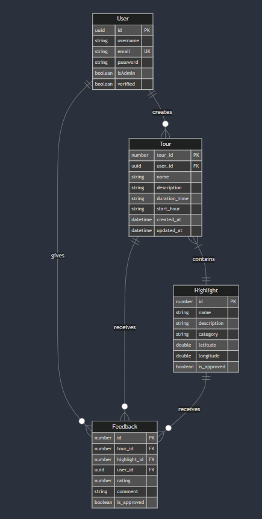

# Introduction
This document provides an in-depth overview of the design and architecture of a web application for managing and viewing tours and associated highlights. Users can explore tour routes displayed on a map, provide feedback, and suggest new highlights. Administrators can manage the tours and highlights.
# General overview and approach
The application aims to provide an intuitive and engaging platform for users to explore tour highlights on an interactive map. It supports user registration, login, and various interactions such as reviewing tours, giving feedback, and suggesting new highlights. Administrators are provided tools to manage tours and highlights. The solution emphasizes a responsive UI, robust backend logic, and secure operations.
# Design considerations
1. **Usability**: Simple navigation and a clear interface.
2. **Scalability**: Ability to support a growing number of users and tours.
3. **Security**: Protect user data with JWT-based authorization.
4. **Performance**: Optimize map rendering and database queries.
5. **Maintainability**: Use modular and clean codebases in Svelte and TypeScript.
# System Architecture

- **User Management**: Handles user registration, login, and authentication.
- **Tour Display**: Shows a list of tours and their associated highlights.
- **Map Integration**: Displays highlights and routes on an interactive map.
- **Feedback and Review**: Allows logged-in users to review tours and give feedback.
- **Highlight Suggestion**: Provides a mechanism for users to suggest new highlights.
- **Administrative Tools**: Enables administrators to manage tours and highlights.

## Software Architecture (Overview)

- **Frontend Framework**: Svelte
- **Backend Framework**: TypeScript with Node.js
- **Database**: MicroORM for database management
- **Mapping Library**: Leaflet
- **Authorization**: JSON Web Tokens (JWT)
- **APIs**: RESTful APIs for communication between frontend and backend
## Information Architecture

- **Tour Data**: Includes tour name, description, and list of associated highlights.
- **Highlight Data**: Includes name, description, location coordinates, and associated media.
- **User Data**: Includes account information, feedback, and review history.
- **Navigation**: Clear links between tours, highlights, and feedback sections.
## Security Architecture

- **Authorization**: JWT for secure access to user-specific and admin functionalities.
- **Data Protection**: Secure storage and transmission of sensitive data using HTTPS and encryption.
- **Role-based Access**: Separate permissions for users and administrators.
## Performance

- **Frontend**: Efficient state management in Svelte.
- **Backend**: Optimized database queries with MicroORM.
- **Map Rendering**: Smooth map interactions with Leaflet.
- **Caching**: Implement server-side caching for frequent requests.
## Database design

## User Interface Design

- **Homepage**: Lists available tours with a search and filter option.
- **Tour Details Page**: Displays highlights on a map, route information, and user reviews.
- **User Dashboard**: Allows users to view feedback history and suggest highlights.
- **Admin Panel**: Provides tools to manage tours and highlights.

## Software Design

- **Frontend**: Developed with Svelte for lightweight and efficient user interfaces.
- **Backend**: Built in TypeScript with RESTful APIs for clear and robust communication.
- **Database**: Managed using MicroORM to ensure clean and maintainable schema interactions.

## Security Design

- **Authentication**: Implemented with JWT for secure session management.
- **Input Validation**: Ensures all user inputs are sanitized to prevent injection attacks.
- **Encryption**: Secure data storage and transfer with encryption.

# Changelog
