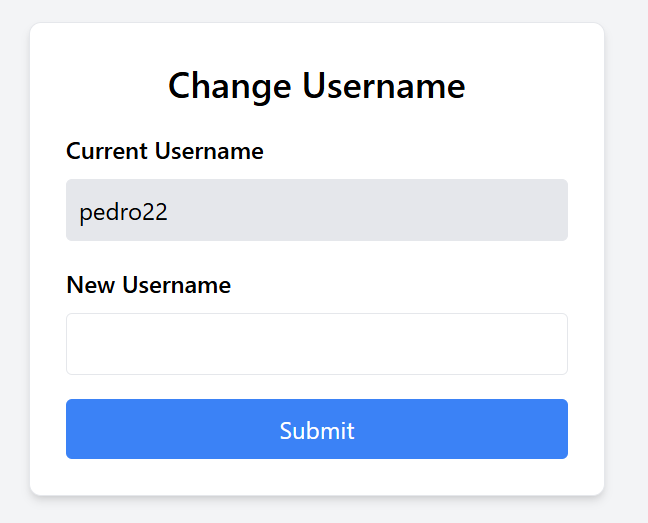
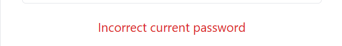
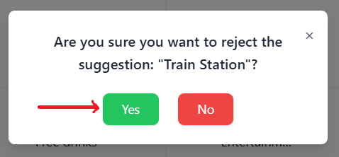

# Test report

## Traceability matrix

### Functional

The table below shows an overview of which test covers which functional requirements

| Test | RFU-08 | SR-19 | RFU-11 | SR-14 | F5 | F6 | F7 | F8 | F9 | F10 | 
|:----:|:------:|:-----:|:------:|:-----:|:--:|:--:|:--:|:--:|:--:|:---:|
|  T1  |   X    |       |        |       |    |    |    |    |    |     | 
|  T2  |   X    |       |        |       |    |    |    |    |    |     |
|  T4  |   X    |       |        |       |    |    |    |    |    |     |
|  T5  |        |       |        |       |    |    |    |    |    |     |  
|  T6  |   X    |       |        |       |    |    |    |    |    |     |
|  T7  |   X    |       |        |       |    |    |    |    |    |     |
|  T8  |   X    |   X   |        |       |    |    |    |    |    |     | 
|  T9  |   X    |       |        |       |    |    |    |    |    |     |
| T10  |   X    |       |        |       |    |    |    |    |    |     |
| T11  |        |       |   X    |   X   |    |    |    |    |    |     |
| T12  |        |       |   X    |   X   |    |    |    |    |    |     |  
| T13  |        |       |   X    |   X   |    |    |    |    |    |     |
| T14  |        |       |   X    |   X   |    |    |    |    |    |     |
| T15  |        |       |        |       |    |    |    |    |    |     | 
| T16  |        |       |        |       |    |    |    |    |    |     |
| T17  |        |       |        |       |    |    |    |    |    |     |
| T18  |        |       |        |       |    |    |    |    |    |     |
| T19  |        |       |        |       |    |    |    |    |    |     |  
| T20  |        |       |        |       |    |    |    |    |    |     |
| T21  |        |       |        |       |    |    |    |    |    |     |

### Non funtional

The table below shows an overview of which test covers which non-functional requirements

##### Unst = (untestable) not able to test it.

| Test | SR_19 | NF2 | NF3 | NF4 | NF5 | NF6 | NF7 | NF8 | NF9 | NF10 | NF11 | NF12 | NF13 | NF14 | NF15 | NF16 | NF17 | NF18 | NF19 | 
|:----:|:-----:|:---:|:---:|:---:|:---:|:---:|:---:|:---:|:---:|:----:|:----:|:----:|:----:|:----:|:----:|:----:|:----:|:----:|:----:|
|  T1  |       |     |     |     |     |     |     |     |     |      |      |      |      |      |      |      |      |      |      |
|  T2  |       |     |     |     |     |     |     |     |     |      |      |      |      |      |      |      |      |      |      |
|  T4  |       |     |     |     |     |     |     |     |     |      |      |      |      |      |      |      |      |      |      |
|  T5  |       |     |     |     |     |     |     |     |     |      |      |      |      |      |      |      |      |      |      |
|  T6  |       |     |     |     |     |     |     |     |     |      |      |      |      |      |      |      |      |      |      |
|  T7  |       |     |     |     |     |     |     |     |     |      |      |      |      |      |      |      |      |      |      |
|  T8  |   X   |     |     |     |     |     |     |     |     |      |      |      |      |      |      |      |      |      |      |
|  T9  |       |     |     |     |     |     |     |     |     |      |      |      |      |      |      |      |      |      |      |
| T10  |       |     |     |     |     |     |     |     |     |      |      |      |      |      |      |      |      |      |      |
| T11  |       |     |     |     |     |     |     |     |     |      |      |      |      |      |      |      |      |      |      |
| T12  |       |     |     |     |     |     |     |     |     |      |      |      |      |      |      |      |      |      |      |
| T13  |       |     |     |     |     |     |     |     |     |      |      |      |      |      |      |      |      |      |      |
| T14  |       |     |     |     |     |     |     |     |     |      |      |      |      |      |      |      |      |      |      |
| T15  |       |     |     |     |     |     |     |     |     |      |      |      |      |      |      |      |      |      |      |
| T16  |       |     |     |     |     |     |     |     |     |      |      |      |      |      |      |      |      |      |      |
| T17  |       |     |     |     |     |     |     |     |     |      |      |      |      |      |      |      |      |      |      |
| T18  |       |     |     |     |     |     |     |     |     |      |      |      |      |      |      |      |      |      |      |
| T19  |       |     |     |     |     |     |     |     |     |      |      |      |      |      |      |      |      |      |      |
| T20  |       |     |     |     |     |     |     |     |     |      |      |      |      |      |      |      |      |      |      |
| T21  |       |     |     |     |     |     |     |     |     |      |      |      |      |      |      |      |      |      |      |

Here you can find the results of the tests that were executed. 
Tester: Rafael Tavares, Botond Vendler, Sarina Bameriniya, Jan  
Date: 17-01-2025 

----------------------------------------------------

# Test cases for a Non-admin user

## Test Case 1

Name: User can log in.  
Status: Success

Step 1 - User starts by clicking the Login button on the navbar.

 

Step 2 - User enters their correct login information into the correct fields.

 

Step 3 - User finishes by clicking Login button on the login page.

 

After these 3 steps the user is successfully logged in.

 

## Test Case 2

Name: User can't log in with incorrect password.  
Status: Success

Step 1 - User starts by clicking the Login button on the navbar.

 

Step 2 - User enters their correct email but incorrect password into the correct fields.

 

Step 3 - User finishes by clicking Login button on the login page.

 

After these 3 steps the user isn't logged in and the site displays a warning.

 

## Test Case 3

Name: User can't log in with invalid password.  
Status: Success

Step 1 - User starts by clicking the Login button on the navbar.

 

Step 2 - User enters their correct email but invalid password into the correct fields.

 

Step 3 - User finishes by clicking Login button on the login page.

 

After these 3 steps the user isn't logged in and the site displays a warning.

 

### Test Case 4

Name: User can't log in with invalid email.  
Status: Success

Step 1 - User starts by clicking the Login button on the navbar.

 

Step 2 - User enters their invalid email but correct password into the correct fields.

 

Step 3 - User finishes by clicking Login button on the login page.

 

After these 3 steps the user isn't logged in and the site displays a warning.

 

## Test Case 5

Name: User can suggest a new highlight.  
Status: Success

Sept 1 - User starts by clicking in the suggest highlight tab in the navigation bar.

 

Sept 2 - User enters the form and needs to fill all information.

 

Sept 3 - User chooses the location from the map.

 

Sept 4 - After all fields are completed user can submit the request.

 

After all 4 steps user is done by requesting for a new highlight.

## Test Case 6

Name: User can change their username  
Status: Success

Sept 1 - User starts by clicking on the User dashboard tab in the navigation bar.

 

Step 2 - User clicks on the change username tab in the navigation bar.

 

Step 3 - User fills in the form by putting their new username.

 

Step 3 - User sees the success message for changing their username.

 

Step 4 - After all 3 steps user is done by changing their username.

 

## Test Case 7

Name: User can't change their password if it's not more than 4 characters long. 
Status: Success

Sept 1 - User starts by putting a username that is less than 5 characters long.

 

after this step user cannot change their username and a warning is shown.

## Test Case 8

Name: User can change their password 
Status: Success

Step 1 - User clicks on change password in user dashboard and encounter the form for filling the required areas for
changing password.

 

Step 2 - User clicks on submit after filling current and new password. They encounter with the success message.

 

After these steps, user's password is successfully changed.

## Test Case 9

Name: User cannot change their password if current password does not match OR new password do not match 
Status: Success

step 1 - User enters an invalid current password.

 

Step 2 - User enters invalid new passwords without using an Uppercase at the beginning of the password.

 

After doing these steps, user cannot change their password.

## Test Case 10

Name: User can log out 
Status: Success

Step 1 - User clicks on logout in user dashboard navigation bar.

 

Step 2 - User clicks on Logout button until they encounter the confirmation of their request.

 

After these steps user will successfully log out and redirect to the login page.

---------------------------------------------------

# Test cases for Moderator

## Test Case 11

Name: Moderator can manage highlights 
Status: Success

Step 1 - Moderator starts by clicking on the moderator dashboard on the nav bar.

 

Step 2 - Moderator clicks on highlights then on the Manage bar.

 

## Test Case 12

Name: Moderator can edit highlights 
Status: Success

Step 1 - Moderator clicks on edit button.

 

Step 2 - Moderator edits the required data then clicks on the confirm button to save the updated data.

 

After all these steps moderator can see the result of edited data on the table.

 

## Test Case 13

Name: Moderator can add new highlights 
Status: Success

Step 1 - Moderator starts by clicking on the add highlight button in manage highlights page.

 

step 2 - Moderator fills in accurate data for adding a new highlight then clicks on the confirm button. (make sure to
add none for business description if it is not needed).

 

Step 3 - Moderator can check the newly added highlight in the table as well as the map.

 

After all these steps moderator can see the result of newly added data on the table.

## Test Case 14

Name: Moderator can delete highlight. 
Status: Success

Step 1 - Moderator clicks on the delete button for the to-be-deleted highlight.

 

Step 2 - Moderator clicks on the "Yes" button to confirm the elimination of the selected highlight.

 

After all these steps moderator can see the result of the deleted highlight on the table.

## Test Case 15

Name: Moderator can manage highlight suggestions 
Status: Success

Step 1 - Moderator starts by clicking on the Suggestions in the moderator dashboard's nav bar.

 

## Test Case 16

Name: Moderator can Accept a highlight suggested by a non-admin user. 
Status: Success

Step 1 - Moderator clicks on the "Accept" button for the selected highlight from user.

 

Step 2 - Moderator clicks on "Yes" button to once more confirm the highlight.

 

Step 3 - Moderator goes to highlight management page to check the accepted highlight.
 

After all these steps moderator can accept the suggested highlight from user and add it to all highlights. They can also
check it on the map.

## Test Case 17

Name: Moderator can reject a highlight suggested by a non-admin user. 
Status: Success

Step 1 - Moderator clicks on the "Reject" button for the selected highlight from user.

 

Step 2 - Moderator clicks on "Yes" button to once more confirm rejecting the highlight.

 

After all these steps moderator can see the state of rejecting a highlight on the table.

 

## Test Case 18

Name: Administrator can manage tours 
Status: Success

Step 1 - Administrator starts by clicking on the Manage Tours tab in the navigation bar.

 

Step 2 - Administrator can see all the tours and can edit, delete or add new tours.

 

## Test Case 19

Name: Administrator can edit tours 
Status: Success

Step 1 - Administrator starts by clicking edit button on the tour they want to edit.

 

Step 2 - Administrator can edit the tour and save the changes.

 

## Test Case 20

Name: Administrator can delete tours 
Status: Success

Step 1 - Administrator starts by clicking delete button on the tour they want to delete.

 

## Test Case 21

Name: Administrator can add tours 
Status: Success

Step 1 - Administrator starts by clicking add tour button.

 

Step 2 - Administrator can fill the form and add the new tour.

 
 