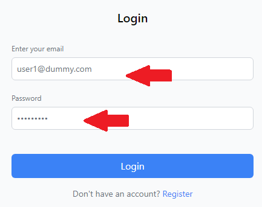
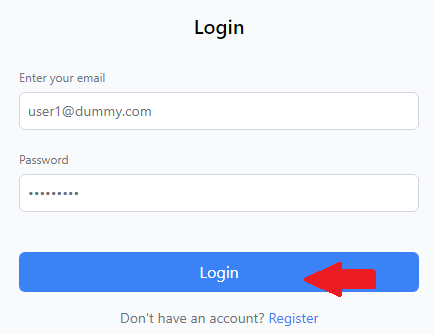
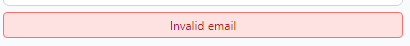

## Test report

Here you can find the results of the tests that were executed. 
Tester: Rafael Tavares, Botond Vendler WEBSITE MAKER 😎  
Date: 17-01-2025 

### Test Case 1
Name: User can log in.  
Status: Success

Step 1 - User starts by clicking the Login button on the navbar.
 

Step 2 - User enters their correct login information into the correct fields.
 

Step 3 - User finishes by clicking Login button on the login page.
 

After these 3 steps the user is successfully logged in.
 

### Test Case 2
Name: User can't log in with incorrect password.  
Status: Success

Step 1 - User starts by clicking the Login button on the navbar.
 

Step 2 - User enters their correct email but incorrect password into the correct fields.
 

Step 3 - User finishes by clicking Login button on the login page.
 

After these 3 steps the user isn't logged in and the site displays a warning.
 

### Test Case 3
Name: User can't log in with invalid password.  
Status: Success

Step 1 - User starts by clicking the Login button on the navbar.
 

Step 2 - User enters their correct email but invalid password into the correct fields.
 

Step 3 - User finishes by clicking Login button on the login page.
 

After these 3 steps the user isn't logged in and the site displays a warning.
 

### Test Case 4
Name: User can't log in with invalid email.  
Status: Success

Step 1 - User starts by clicking the Login button on the navbar.
 

Step 2 - User enters their invalid email but correct password into the correct fields.
 

Step 3 - User finishes by clicking Login button on the login page.
 

After these 3 steps the user isn't logged in and the site displays a warning.
 

### Test Case 5
Name: User can suggest a new highlight.  
Status: Success

Sept 1 - User starts by clicking in the suggest highlight tab in the navigation bar.
 

Sept 2 - User enter the form and needs to fill all information.
 

Sept 3 - User choses the location from the map.
 

Sept 4 - After all fields are completed user can submit the request.
 

After all 4 steps user is done by requesting for a new highlight.